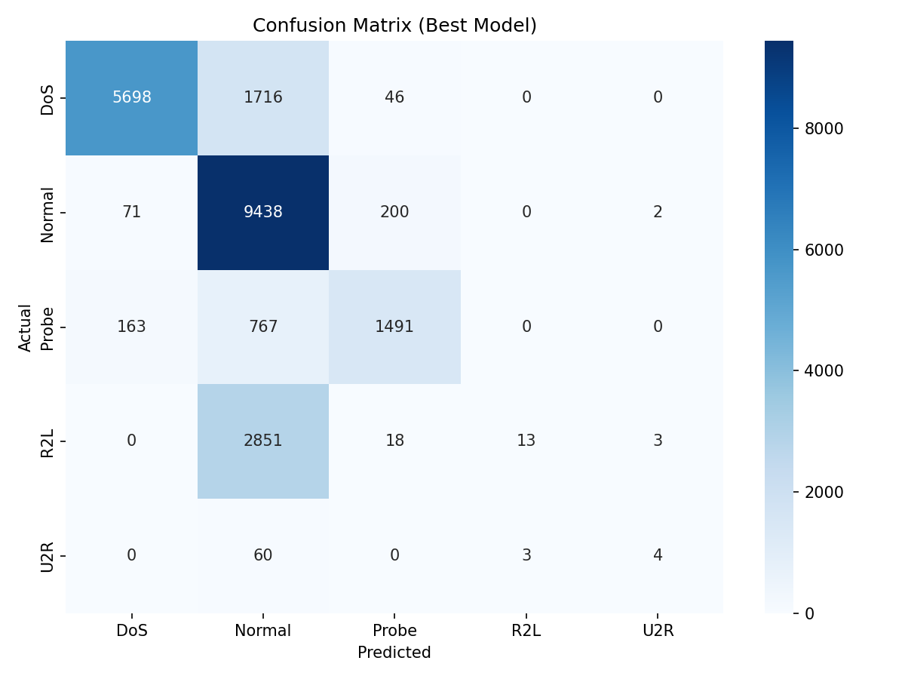
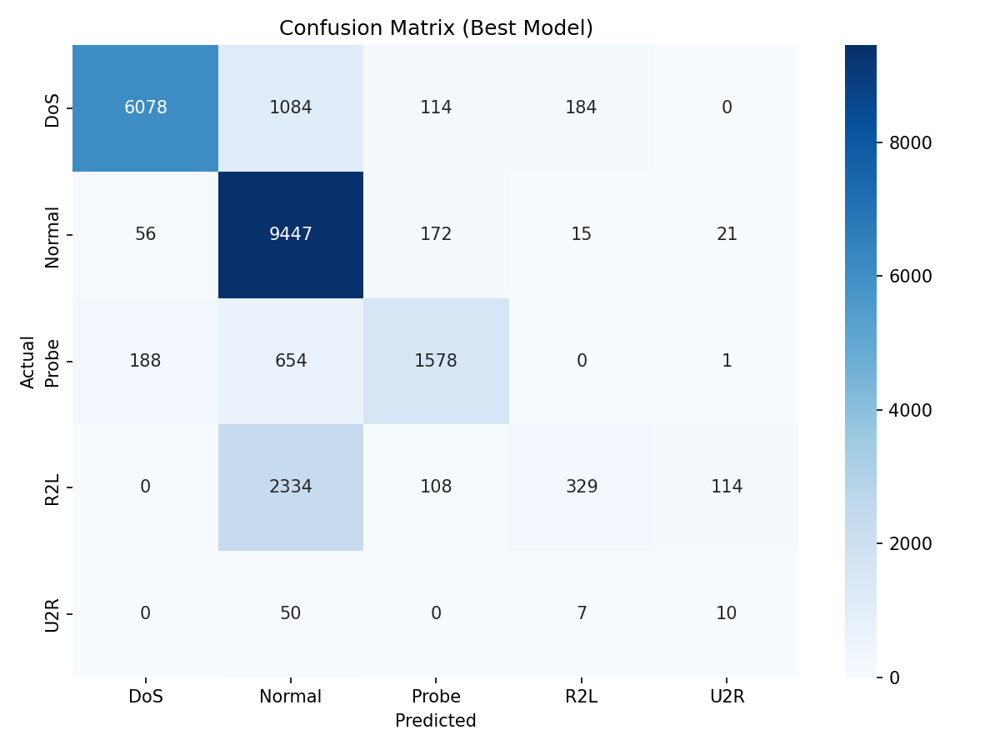

# Network Intrusion Detection Model Evaluation Report

## Run Details: 20260514_144920

**Model:** RandomForestClassifier

### Best Hyperparameters

| Parameter | Value |
| :--- | :--- |
| `class_weight` | `balanced_subsample` |
| `max_depth` | `None` |
| `min_samples_split` | `10` |
| `n_estimators` | `200` |

### Performance Metrics

- **Cross-Validation Macro F1-score:** `0.9408`
- **Test Set Macro F1-score:** `0.4897`

### Test Set Classification Report

| Class | Precision | Recall | F1-Score | Support |
| :--- | :--- | :--- | :--- | :--- |
| DoS | 0.9606 | 0.7638 | 0.8510 | 7460 |
| Normal | 0.6363 | 0.9719 | 0.7691 | 9711 |
| Probe | 0.8496 | 0.6159 | 0.7141 | 2421 |
| R2L | 0.8125 | 0.0045 | 0.0090 | 2885 |
| U2R | 0.4444 | 0.0597 | 0.1053 | 67 |
| **Macro Avg** | **0.7407** | **0.4832** | **0.4897** | **22544** |
| **Weighted Avg** | **0.7885** | **0.7383** | **0.6910** | **22544** |

### Confusion Matrix

---

## Run Details: 20260514_145613

**Model:** XGBClassifier

### Best Hyperparameters

| Parameter | Value |
| :--- | :--- |
| `learning_rate` | `0.2` |
| `max_depth` | `6` |
| `n_estimators` | `200` |
| `subsample` | `0.8` |

### Performance Metrics

- **Cross-Validation Macro F1-score:** `0.9436`
- **Test Set Macro F1-score:** `0.5630`

### Test Set Classification Report

| Class | Precision | Recall | F1-Score | Support |
| :--- | :--- | :--- | :--- | :--- |
| DoS | 0.9618 | 0.8237 | 0.8874 | 7460 |
| Normal | 0.6714 | 0.9701 | 0.7936 | 9711 |
| Probe | 0.8371 | 0.6964 | 0.7603 | 2421 |
| R2L | 0.9574 | 0.0312 | 0.0604 | 2885 |
| U2R | 0.8125 | 0.1940 | 0.3133 | 67 |
| **Macro Avg** | **0.8481** | **0.5431** | **0.5630** | **22544** |
| **Weighted Avg** | **0.8223** | **0.7698** | **0.7258** | **22544** |

### Confusion Matrix

---

## Run Details: 20260514_150257

**Model:** SVC

### Best Hyperparameters

| Parameter | Value |
| :--- | :--- |
| `C` | `10` |
| `gamma` | `auto` |
| `kernel` | `rbf` |

### Performance Metrics

- **Cross-Validation Macro F1-score:** `0.7753`
- **Test Set Macro F1-score:** `0.5397`

### Test Set Classification Report

| Class | Precision | Recall | F1-Score | Support |
| :--- | :--- | :--- | :--- | :--- |
| DoS | 0.9614 | 0.8147 | 0.8820 | 7460 |
| Normal | 0.6962 | 0.9728 | 0.8116 | 9711 |
| Probe | 0.8002 | 0.6518 | 0.7184 | 2421 |
| R2L | 0.6150 | 0.1140 | 0.1924 | 2885 |
| U2R | 0.0685 | 0.1493 | 0.0939 | 67 |
| **Macro Avg** | **0.6283** | **0.5405** | **0.5397** | **22544** |
| **Weighted Avg** | **0.7829** | **0.7737** | **0.7435** | **22544** |

### Confusion Matrix

---

