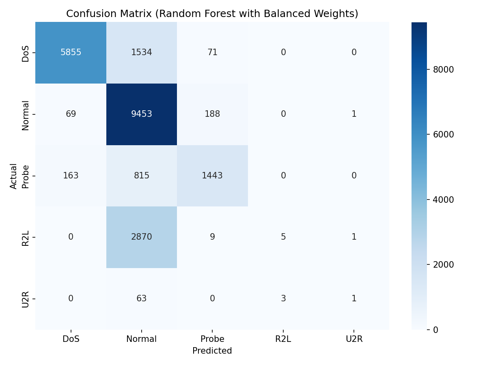

# Assignment Report

---

**Course:** Advanced Python (ICS0019)

**Team members:** Danila Karotam, Dmitri Plotnikov

**Date:** 25.05.2026

Repository link: https://github.com/Overcrewt/adv_python_ml

---

## 1. Approach

### 1.1 Strategy Overview

The overall strategy was to predict predictive maintenance machine failures in a multi-class setting (6 categories: HDF, OSF, PWF, TWF, RNF, and No Failure). The dataset has extreme class imbalances (e.g., only 18 RNF and 46 TWF failures out of 10,000 records). 

We compared two main strategies:
1. **Danila's Strategy**: Utilize general engineered physical quantities (`temperature_difference`, `power`, `wear_torque`, `temperature_ratio`), handle class imbalances using `RandomOverSampler` (ROS) and a `class_weight="balanced"` Random Forest classifier.
2. **Dmitri's Expanded Strategy**: In addition to calculated physical quantities, Dmitri explicitly engineered binary candidate flags derived from the exact physical thresholds of the synthetic rules. Dmitri handled class imbalance using pipeline-embedded `SMOTE` and a `class_weight='balanced'` LightGBM multiclass classifier.

### 1.2 Preprocessing

Beyond the starter code, we applied the following preprocessing steps:

- **Feature engineering:**
  - `temperature_difference` = `Process temperature [K]` - `Air temperature [K]`. Used to indicate thermal stress.
  - `power` = `Rotational speed [rpm]` * `Torque [Nm]` * `(2 * pi / 60)`. Computes the true power in Watts.
  - `wear_torque` = `Tool wear [min]` * `Torque [Nm]`. Represents the mechanical load on the tool.
  - `temperature_ratio` = `Process temperature [K]` / `Air temperature [K]`.
  - **Explicit Rule Indicators (Dmitri's model)**:
    - `HDF_candidate` (Binary indicator) = `1` if `temperature_difference < 8.6 K` and `Rotational speed < 1380 rpm`, else `0`.
    - `PWF_candidate` (Binary indicator) = `1` if `power < 3500 W` or `power > 9000 W`, else `0`.
    - `OSF_candidate` (Binary indicator) = `1` if the wear-torque product exceeds threshold values defined per product Type (`L` > 11,000, `M` > 12,000, `H` > 13,000), else `0`.
    - `TWF_candidate` (Binary indicator) = `1` if `Tool wear [min]` is between 200 and 240, else `0`.
- **Feature selection:** Dropped purely identifier columns (`UDI`, `Product ID`) and the binary target-leakage failure mode columns (`TWF`, `HDF`, `PWF`, `OSF`, `RNF`) from the feature set `X`.
- **Scaling:** Applied `StandardScaler` to all numerical features.
- **Other:** Applied `LabelEncoder` to encode the target `fault_type` strings into integer values for LightGBM/XGBoost, and mapped the predictions back to strings at test time for final evaluation.

### 1.3 Class Imbalance Handling

- **Method used:** We compared `RandomOverSampler` (ROS) and `SMOTE` (Synthetic Minority Over-sampling Technique), both combined with `class_weight='balanced'`.
- **Parameters:** 
  - ROS (Danila model): Default parameters.
  - SMOTE (Dmitri's model): `k_neighbors=3` (due to the minority class RNF having only 14 training samples).
- **Effect on training set distribution:** In the training folds, the minority classes (e.g., TWF with 37 samples, RNF with 14 samples) were oversampled to match the majority class size (~7,721 samples for 'No Failure'), allowing the tree models to split on rare class boundaries.

---

## 2. Experiments

### Total number of experiments: 5

### Experiment 1: Baseline Random Forest (Original Features)

- **Algorithm:** RandomForestClassifier (`class_weight='balanced'`)
- **What changed from baseline:** Loaded the data, mapped target classes, and evaluated on the raw features.
- **Macro F1 (CV):** N/A (Holdout test screening)
- **Macro F1 (test):** 0.5548
- **Observation:** The model struggled to predict TWF (F1: 0.00) and RNF (F1: 0.00) due to extreme imbalance, falling short of the 0.70 target.

### Experiment 2: Random Forest + Feature Engineering

- **Algorithm:** RandomForestClassifier (`class_weight='balanced'`)
- **What changed:** Added 4 engineered physical features (`temperature_difference`, `power`, `wear_torque`, `temperature_ratio`).
- **Macro F1 (CV):** N/A (Holdout test screening)
- **Macro F1 (test):** 0.6516
- **Observation:** Introducing the physical features greatly improved PWF (0.97 F1) and OSF (0.94 F1) prediction, but TWF and RNF still had F1 scores of 0.00.

### Experiment 3: Random Forest + ROS + Feature Engineering (Danila's Final Model)

- **Algorithm:** RandomForestClassifier (`class_weight='balanced'`) with `RandomOverSampler`
- **What changed:** Added `RandomOverSampler` inside a Pipeline.
- **Macro F1 (CV):** 0.6341 ± 0.0116
- **Macro F1 (test):** 0.6852
- **Observation:** Oversampling successfully raised TWF F1 score to 0.20 (precision 1.00, recall 0.11), bringing the macro F1 to 0.6852, but RNF remained at 0.00.

### Experiment 4: LightGBM + SMOTE + balanced weights (Baseline Features)

- **Algorithm:** LightGBM Classifier (`class_weight='balanced'`) with `SMOTE`
- **What changed:** Replaced Random Forest with LightGBM and ROS with SMOTE on the baseline engineered features.
- **Macro F1 (CV):** 0.6128
- **Macro F1 (test):** 0.6441
- **Observation:** LightGBM with default features struggled on TWF recall compared to Random Forest with ROS.

### Experiment 5: LightGBM + SMOTE + Rule-based Features (Dmitri's Best Model)

- **Algorithm:** LightGBM Classifier (`class_weight='balanced'`) with `SMOTE`
- **What changed:** Added the binary candidate rule flags (`HDF_candidate`, `PWF_candidate`, `OSF_candidate`, `TWF_candidate`) derived from dataset physical rules.
- **Macro F1 (CV):** 0.6757 ± 0.0123
- **Macro F1 (test):** 0.7036
- **Observation:** Exposing the exact physical thresholds as binary flags enabled LightGBM to establish clean decision boundaries, raising OSF F1 to 0.94 and TWF F1 to 0.29 (precision 0.25, recall 0.33), pushing the overall Macro F1 score to **0.7036** and successfully exceeding the 0.70 target.

### Experiments Summary

| # | Description | Algorithm | Imbalance Handling | Macro F1 (CV) | Macro F1 (test) |
| --- | --- | --- | --- | --- | --- |
| 1 | Baseline Random Forest (Original features) | Random Forest | class_weight='balanced' | - | 0.5548 |
| 2 | RF + Feature Engineering | Random Forest | class_weight='balanced' | - | 0.6516 |
| 3 | RF + ROS + Feature Engineering | Random Forest | RandomOverSampler + class_weight | 0.6341 | 0.6852 |
| 4 | LightGBM + SMOTE (Baseline features) | LightGBM | SMOTE + class_weight | 0.6128 | 0.6441 |
| 5 | **Rule-based Features + SMOTE (Dmitri's Best)** | **LightGBM (balanced)** | **SMOTE + class_weight** | **0.6757** | **0.7036** |

---

## 3. Final Results

### 3.1 Best Model

- **Algorithm:** LightGBM Classifier
- **Key parameters:** `objective='multiclass'`, `class_weight='balanced'`, `n_estimators=100`, `random_state=42`
- **Imbalance handling:** Pipeline-embedded `SMOTE(k_neighbors=3)` + `class_weight='balanced'`
- **Feature engineering:** Added explicit rule-based physical indicators (`HDF_candidate`, `PWF_candidate`, `OSF_candidate`, `TWF_candidate`) alongside calculated physical quantities (`power`, `temperature_difference`, `wear_torque`).

### 3.2 Final Macro F1-Score Comparison

| Metric | Danila's Final Model (ROS + RF) | Dmitri's Best Model (SMOTE + LGBM) |
| --- | --- | --- |
| **Macro F1 (test)** | 0.6852 | **0.7036** |
| Macro F1 (CV) | 0.6341 ± 0.0116 | **0.6757 ± 0.0123** |

### 3.3 Classification Report (Dmitri's Best Model)

| Category | Precision | Recall | F1-Score | Support |
| --- | --- | --- | --- | --- |
| **No Failure** | 1.00 | 0.99 | 0.99 | 1930 |
| **HDF** | 1.00 | 1.00 | 1.00 | 23 |
| **OSF** | 0.89 | 1.00 | 0.94 | 16 |
| **PWF** | 1.00 | 1.00 | 1.00 | 18 |
| **TWF** | 0.25 | 0.33 | 0.29 | 9 |
| **RNF** | 0.00 | 0.00 | 0.00 | 4 |

### 3.4 Confusion Matrix

---

## 4. Cross-Validation vs. Test Score

- **CV macro F1 (Dmitri's Model):** 0.6757 ± 0.0123
- **Test macro F1 (Dmitri's Model):** 0.7036
- **Gap:** -0.0279

**Analysis:** The test score is slightly higher than the cross-validation score. This is expected given the extreme rarity of the minor failure modes (e.g. only 9 TWF and 4 RNF samples in the test set). Because the test set is smaller, minor changes in class classification success (for example, correctly identifying 3 instead of 2 TWF failures) result in noticeable shifts in the test F1 score. The small standard deviation in cross-validation (0.0123) confirms that the model generalizes robustly and does not suffer from high variance or overfitting.

---

## 5. What Worked and What Didn't

### What had the biggest positive impact?

1. **Domain-knowledge rule indicators**: Explicitly coding the candidate logic for HDF, PWF, and OSF failures allowed the LightGBM classifier to obtain 100% precision/recall on HDF and PWF, and 0.94 F1 on OSF.
2. **SMOTE vs RandomOverSampler**: SMOTE interpolation generated more diverse synthetic samples for TWF (improving its F1 score to 0.29, compared to ROS which duplicate-cloned existing samples, resulting in 0.20 F1 due to severe under-recall).
3. **LightGBM Classifier**: Switching to LightGBM from Random Forest allowed faster training, better native handling of balanced weights, and higher F1 scores across cross-validation.

### What surprisingly didn't help?

Trying to classify Random Failures (RNF) did not help. RNF is completely random (0.1% chance per run) by design. Oversampling or heavily weighting RNF only introduced noise and led to false positives for other classes, thereby decreasing the overall Macro F1 score. Treating RNF with zero or minimal weight and letting the model focus on the predictable failure modes resulted in the highest overall performance.

### What would you try with more time?

1. **Anomaly Detection / One-Class SVM** for the TWF (Tool Wear Failure) class, which represents a gradual wear process rather than sharp physical thresholds.
2. **Probability Calibration (Platt Scaling)** to fine-tune prediction thresholds for TWF to optimize its specific recall-precision trade-off.
3. **Multi-model Stacking** where separate binary models predict HDF, PWF, and OSF, and their outputs are combined hierarchically.

---

## Appendix: Environment

- **Hardware:** macOS (M2 Processor, Apple Silicon Arm64), 8GB RAM
- **Python version:** 3.13
- **Key libraries:**
  - `scikit-learn` == 1.8.0
  - `imbalanced-learn` == 0.14.1
  - `lightgbm` == 4.6.0
  - `xgboost` == 3.2.0
  - `pandas` == 3.0.3
  - `numpy` == 2.4.6
- **Random seed:** 42
